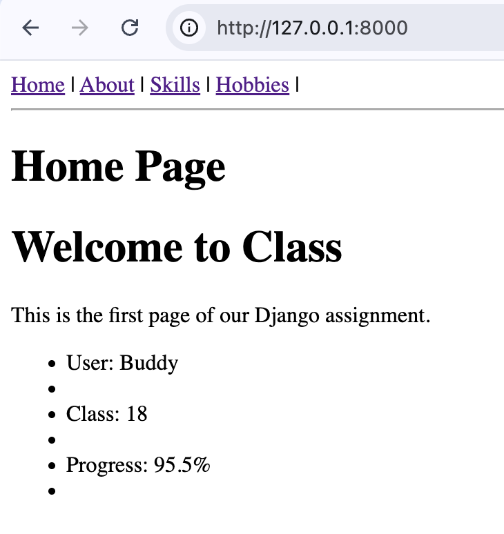
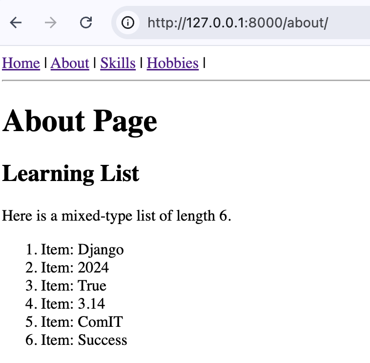
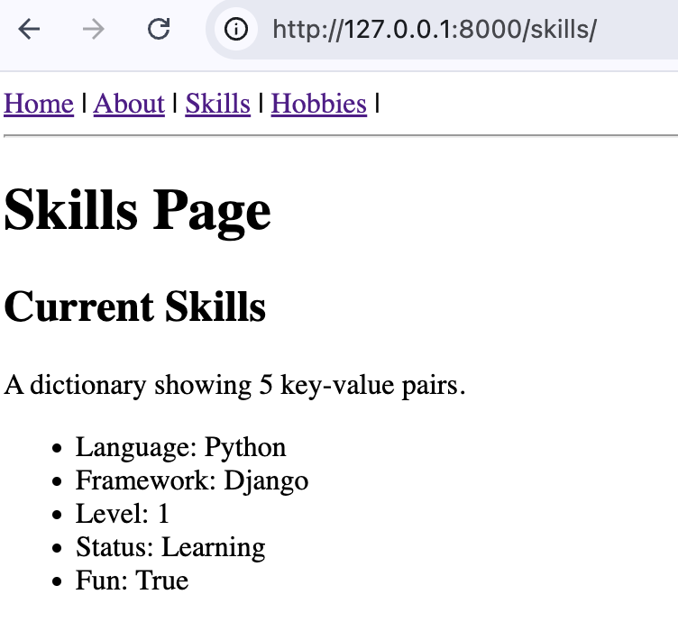
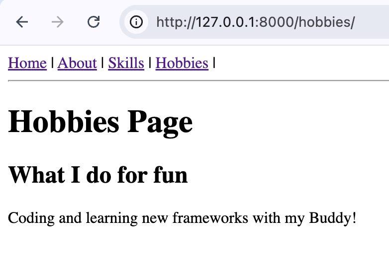

# 🌐 Django Static Pages Manager (Exercise 1)

A basic Django web application built to demonstrate the request-response cycle. This project uses `HttpResponse` to serve 4 unique web pages without using HTML templates, showcasing basic data structures and routing.

---

## 📂 Project Structure

```text
django_project/
│
├── config/             # Configuration files (settings.py, urls.py)
├── my_pages/           # App logic (views.py)
├── manage.py           # Django command utility
└── README.md           # Documentation
```

---

## ✅ Requirements Checklist
- [x] Create 4 web pages (None named 'contact').
- [x] Navigation bar with `|` separator on every page.
- [x] Use `<h1>`, `<h2>`, and `<p>` tags.
- [x] Implement 3 variables of different types.
- [x] Implement a mixed-type list of length 6.
- [x] Implement a dictionary of length 5 (String keys, mixed values).
- [x] Use `f-strings` with `<ul>` or `<ol>` for data display.

---

## 💻 Code Snippets

### 1. config/settings.py
```python
INSTALLED_APPS = [
    'django.contrib.admin',
    'django.contrib.auth',
    'django.contrib.contenttypes',
    'django.contrib.sessions',
    'django.contrib.messages',
    'django.contrib.staticfiles',
    'my_pages',
]
```

### 2. config/urls.py
```python
from django.contrib import admin
from django.urls import path
from my_pages import views

urlpatterns = [
    path('admin/', admin.site.urls),
    path('', views.home, name='home'),
    path('about/', views.about, name='about'),
    path('skills/', views.skills, name='skills'),
    path('hobbies/', views.hobbies, name='hobbies'),
]
```

### 3. my_pages/views.py
```python
from django.shortcuts import render
from django.http import HttpResponse

nav = """
    <nav>
        <a href='/'>Home</a> |
        <a href='/about/'>About</a> |
        <a href='/skills/'>Skills</a> |
        <a href='/hobbies/'>Hobbies</a>
    </nav>
    <hr>
"""

def home(request):
    user_name = "Buddy"
    lesson_num = 18
    progress = 95.5
    content = f"""
        <h1>Home Page</h1>
        <h2>Welcome to Class</h2>
        <p>This is the first page of our Django assignment.</p>
        <ul>
            <li>User: {user_name}</li>
            <li>Class: {lesson_num}</li>
            <li>Progress: {progress}%</li>
        </ul>
    """
    return HttpResponse(nav + content)

def about(request):
    my_list = ["Django", 2024, True, 3.14, "ComIT", "Success"]
    items = "".join([f"<li>Item: {x}</li>" for x in my_list])
    content = f"""
        <h1>About Page</h1>
        <h2>Learning List</h2>
        <p>Here is a mixed-type list of length 6.</p>
        <ol>{items}</ol>
    """
    return HttpResponse(nav + content)

def skills(request):
    my_dict = {"Language": "Python", "Framework": "Django", "Level": 1, "Status": "Learning", "Fun": True}
    items = "".join([f"<li>{k}: {v}</li>" for k, v in my_dict.items()])
    content = f"""
        <h1>Skills Page</h1>
        <h2>Current Skills</h2>
        <p>A dictionary showing 5 key-value pairs.</p>
        <ul>{items}</ul>
    """
    return HttpResponse(nav + content)

def hobbies(request):
    content = """
        <h1>Hobbies Page</h1>
        <h2>What I do for fun</h2>
        <p>Coding and learning new frameworks with my Buddy!</p>
    """
    return HttpResponse(nav + content)
```

---

## 📸 Screenshots

### 1. Home Page


### 2. About Page


### 3. Skills Page


### 4. Hobbies Page


---

## 🔗 Project Links
- **Repository:** https://github.com/lazy-h-null/my-exercise-archive/tree/main/20-apr13
```