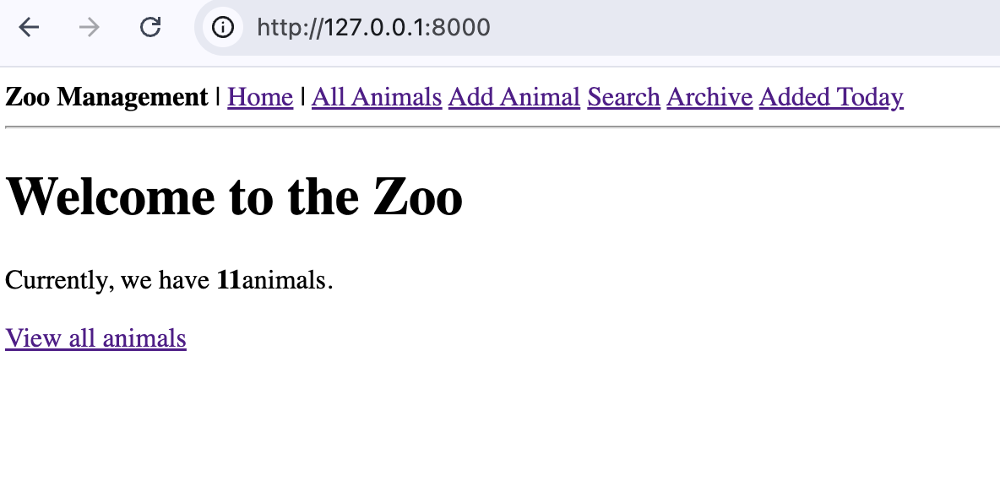
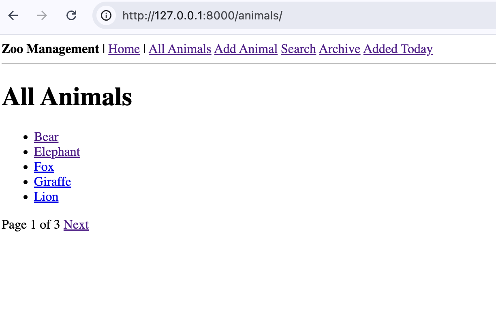
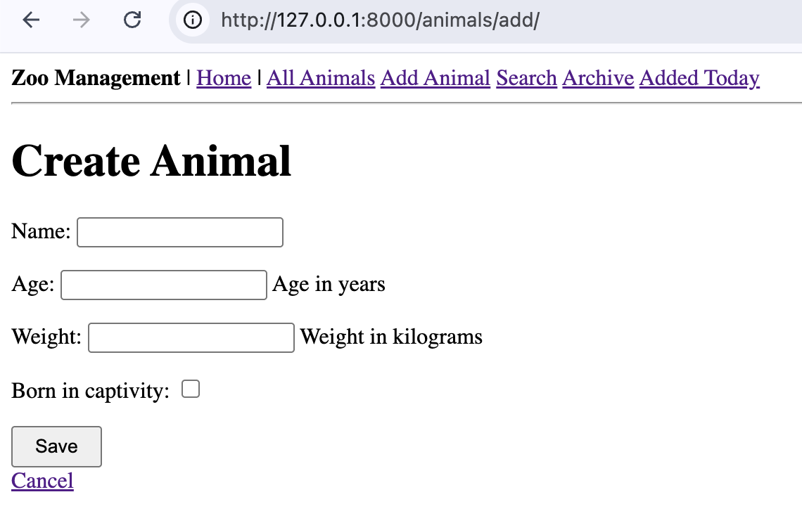
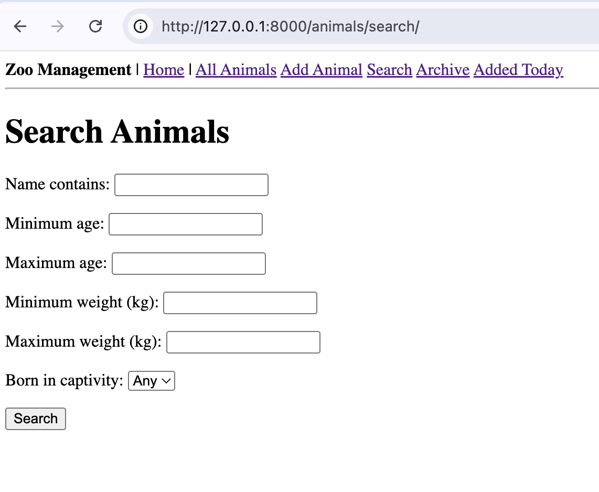
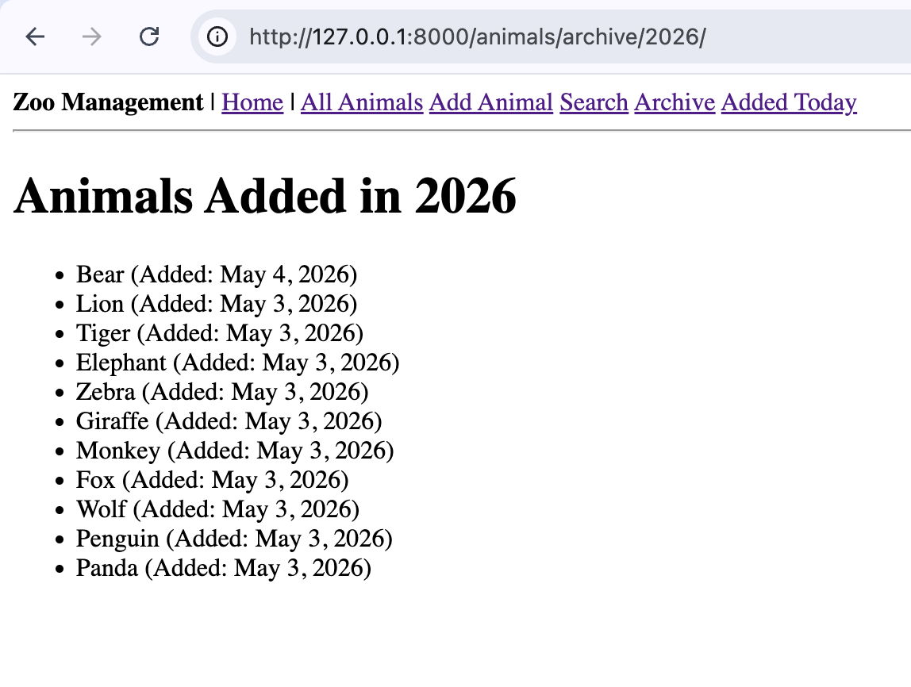
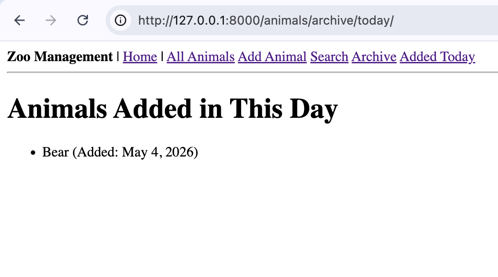
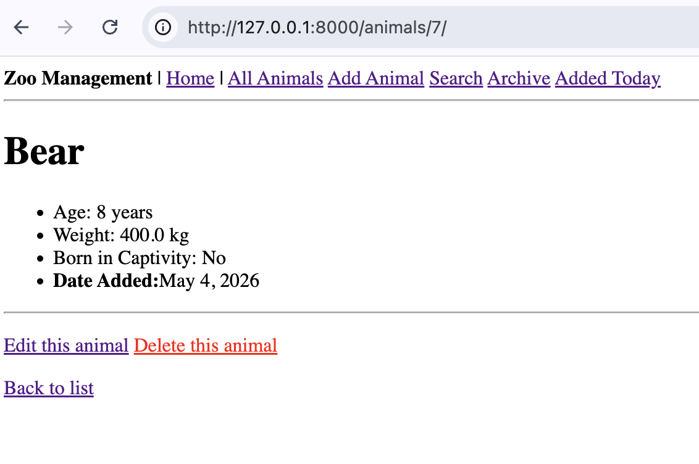
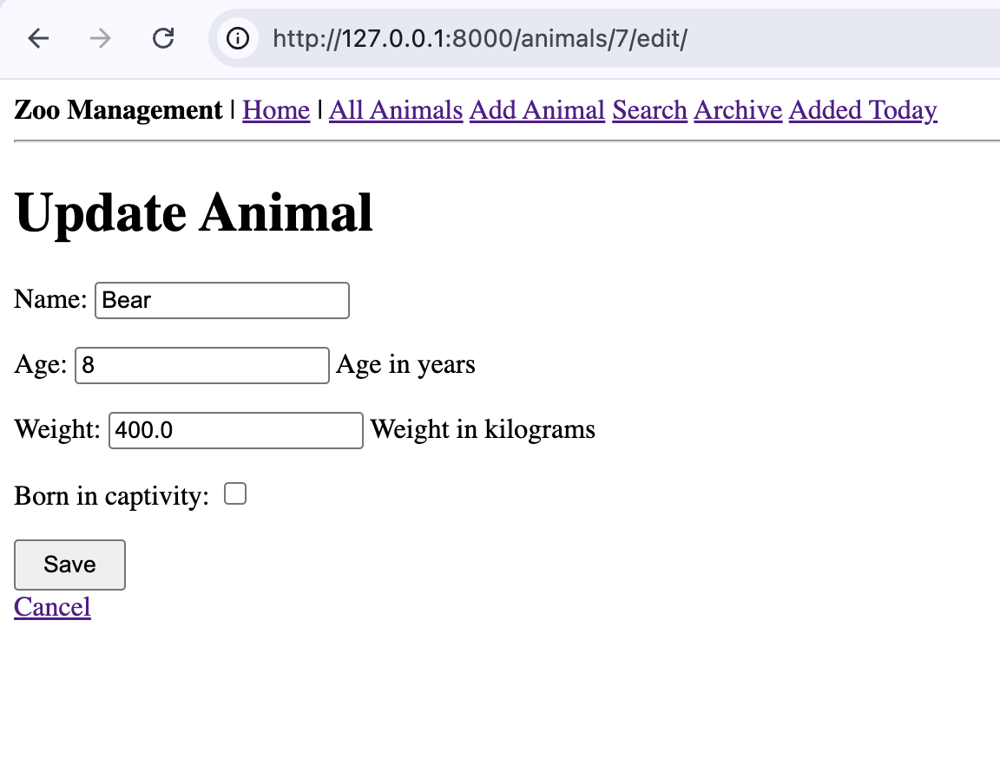
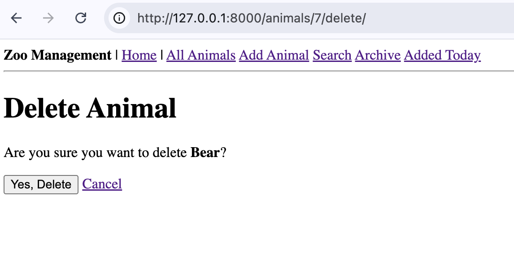

# 🦁 My Django Zoo App (Class 24)

This is a project I made to learn how to manage data in Django. I built a system to add, see, change, and delete animals in a zoo using **Class-Based Views**.

---

## ✅ Project Checklist

- [x] **App Setup:** Created the `animals` app and added it to the project settings.
- [x] **Model:** Made an `Animal` model to save name, age, weight, and the date it was added.
- [x] **CRUD:** Successfully used Django's generic views to **Create, List, Update, and Delete** animals.
- [x] **Pagination:** Made the list show only 5 animals per page so it looks clean.
- [x] **Search:** Built a search page where you can find animals by their name or age.
- [x] **Archive:** Added a feature to see animals grouped by the year or day they arrived.
- [x] **Templates:** Made a `base.html` with a navigation bar that stays on every page.
- [x] **Admin:** Used the Django Admin to add my first 11 animals.

---

## 💻 Core Implementation

### 1. `animals/models.py`
```python
from django.db import models
from django.urls import reverse
from django.utils import timezone
# Create your models here.

class Animal(models.Model):
    name = models.CharField(max_length=100)
    age = models.IntegerField(help_text="Age in years")
    weight = models.FloatField(help_text="Weight in kilograms")
    born_in_captivity = models.BooleanField(default=False)
    date_added = models.DateField(default=timezone.now)

    class Meta:
        ordering = ['name']

    def __str__(self):
        return f"{self.name} (age {self.age})"

    def get_absolute_url(self):
        return reverse('animals:animal-detail', kwargs={'pk': self.pk})
```

### 2. `animals/views.py`
```python
from django.urls import reverse_lazy
from django.views.generic import (TemplateView, ListView, DetailView, CreateView, UpdateView, DeleteView, FormView)
from .models import Animal
from .forms import AnimalSearchForm
from django.views.generic.dates import ArchiveIndexView, YearArchiveView, MonthArchiveView, TodayArchiveView
from django.views.generic import RedirectView

# Create your views here.
class HomeView(TemplateView):
    template_name = 'animals/home.html'

    def get_context_data(self, **kwargs):
        context = super().get_context_data(**kwargs)
        context['page_title'] = 'Welcome to the Zoo'
        context['total_animals'] = Animal.objects.count()
        context['captive_count'] = Animal.objects.filter(born_in_captivity=True).count()
        context['wild_count'] = Animal.objects.filter(born_in_captivity=False).count()
        return context
    

class AnimalListView(ListView):
    model = Animal
    template_name = 'animals/animal_list.html'
    context_object_name = 'animals'
    paginate_by = 5

    def get_context_data(self, **kwargs):
        context = super().get_context_data(**kwargs)
        context['total_count'] = Animal.objects.count()
        return context
    

class AnimalDetailView(DetailView):
    model = Animal
    template_name = 'animals/animal_detail.html'
    context_object_name = 'animal'


class AnimalCreateView(CreateView):
    model = Animal
    fields = ['name', 'age', 'weight', 'born_in_captivity']
    template_name = 'animals/animal_form.html'
    
    def get_context_data(self, **kwargs):
        context = super().get_context_data(**kwargs)
        context['form_action'] = 'Create'
        return context
    

class AnimalUpdateView(UpdateView):
    model = Animal
    fields = ['name', 'age', 'weight', 'born_in_captivity']
    template_name = 'animals/animal_form.html'

    def get_context_data(self, **kwargs):
        context = super().get_context_data(**kwargs)
        context['form_action'] = 'Update'
        return context
    

class AnimalDeleteView(DeleteView):
    model = Animal
    template_name = 'animals/animal_confirm_delete.html'
    success_url = reverse_lazy('animals:animal-list')
    

class AnimalSearchView(FormView):
    template_name = 'animals/animal_search.html'
    form_class = AnimalSearchForm

    def get_form_kwargs(self):
        kwargs = super().get_form_kwargs()
        if self.request.method == 'GET' and self.request.GET:
            kwargs['data'] = self.request.GET
        return kwargs
    
    def get_context_data(self, **kwargs):
        context = super().get_context_data(**kwargs)
        context['results'] = None
        context['search_performed'] = False
        form = context['form']
        if self.request.GET and form.is_valid():
            data = form.cleaned_data
            queryset = Animal.objects.all()
            if data.get('name'): queryset = queryset.filter(name__icontains=data['name'])
            if data.get('min_age') is not None: queryset = queryset.filter(age__gte=data['min_age'])
            context['results'] = queryset
            context['search_performed'] = True
        return context
    

class ZooRedirectView(RedirectView):
    permanent = False
    pattern_name = 'animals:home'


class AnimalArchiveIndexView(ArchiveIndexView):
    model = Animal
    date_field = 'date_added'
    template_name = 'animals/animal_archive.html'
    allow_empty = True


class AnimalYearArchiveView(YearArchiveView):
    model = Animal
    date_field = 'date_added'
    template_name = 'animals/animal_archive_year.html'
    make_object_list = True
    allow_empty = True


class AnimalMonthArchiveView(MonthArchiveView):
    model = Animal
    date_field = 'date_added'
    template_name = 'animals/animal_archive_month.html'
    month_format = '%m'
    allow_empty = True

class AnimalTodayArchiveView(TodayArchiveView):
    model = Animal
    date_field = 'date_added'
    template_name = 'animals/animal_archive_day.html'
    allow_empty = True
```

### 3. `animals/urls.py`
```python
from django.urls import path
from . import views

app_name = 'animals'

urlpatterns = [
    path('zoo/', views.ZooRedirectView.as_view(), name='zoo-redirect'),
    path('', views.HomeView.as_view(), name='home'),
    path('animals/', views.AnimalListView.as_view(), name='animal-list'),
    path('animals/<int:pk>/', views.AnimalDetailView.as_view(), name='animal-detail'),
    path('animals/add/', views.AnimalCreateView.as_view(), name='animal-create'),
    path('animals/<int:pk>/edit/', views.AnimalUpdateView.as_view(), name='animal-update'),
    path('animals/<int:pk>/delete/', views.AnimalDeleteView.as_view(), name='animal-delete'),
    path('animals/search/', views.AnimalSearchView.as_view(), name='animal-search'),
    path('animals/archive/', views.AnimalArchiveIndexView.as_view(), name='animal-archive-index'),
    path('animals/archive/<int:year>/', views.AnimalYearArchiveView.as_view(), name='animal-year-archive'),
    path('animals/archive/<int:year>/<int:month>/', views.AnimalMonthArchiveView.as_view(), name='animal-month-archive'),
    path('animals/archive/today/', views.AnimalTodayArchiveView.as_view(), name='animal-today-archive'),
]
```

---

## 📸 Screenshots
|  | Screenshot Preview |
| :--- |:--- |
| **Home** |  |
| **All Animals** |  |
| **Add Animal** |  |
| **Search** |  |
| **Archive** |  |
| **Added Today** |  |
| **Detail** |  |
| **Edit** |  |
| **Delete** |  |

---

## 🔗 Project Links
- **Repository:** https://github.com/lazy-h-null/my-exercise-archive/tree/main/24-apr22
