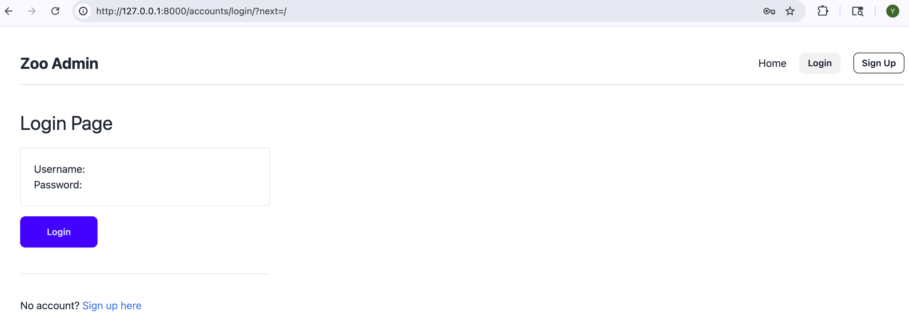
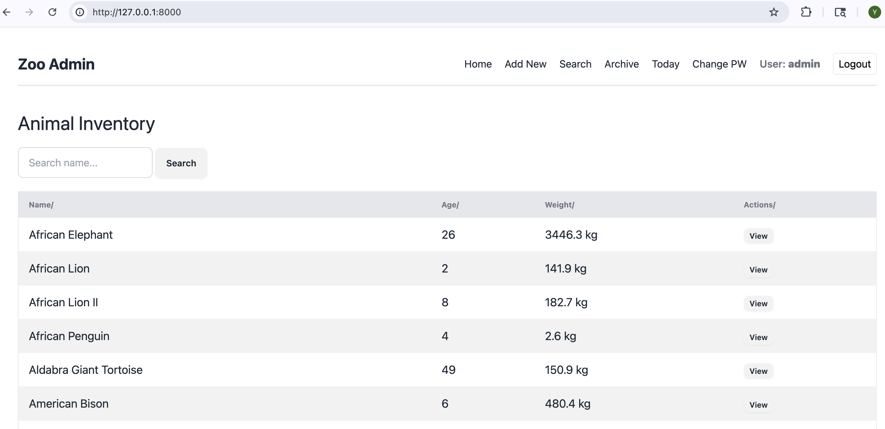
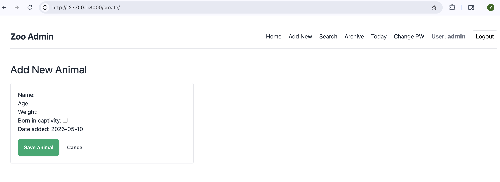
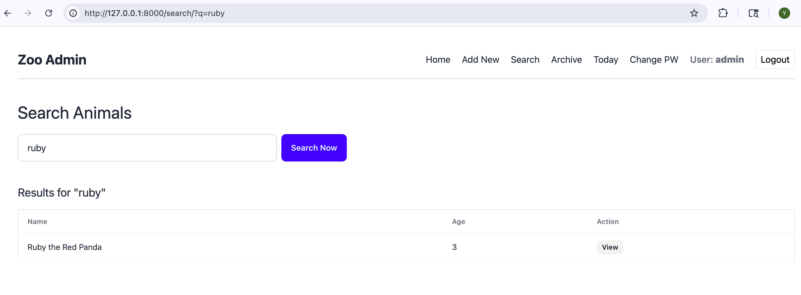
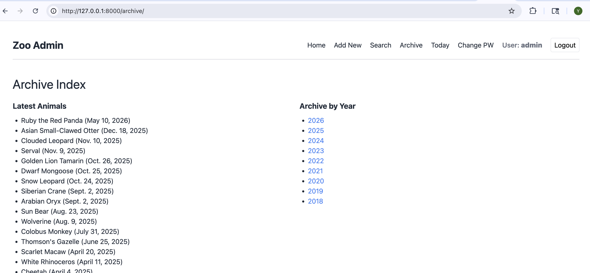
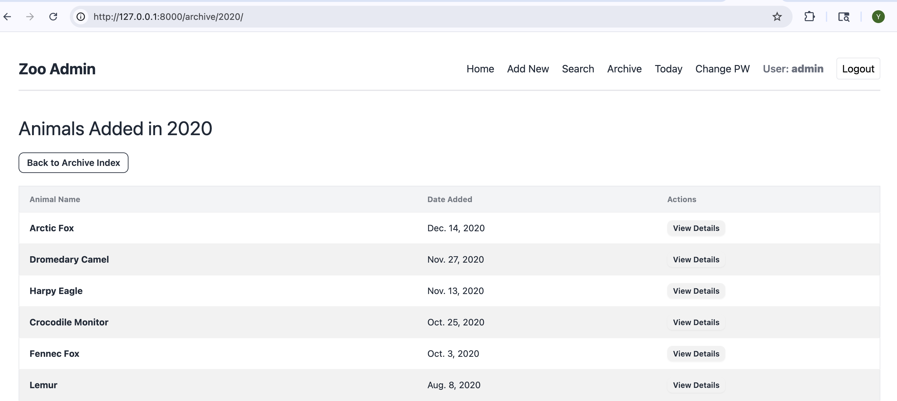
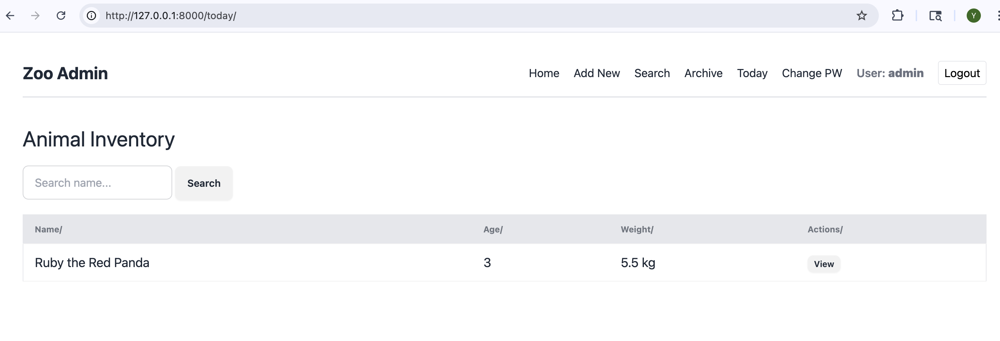
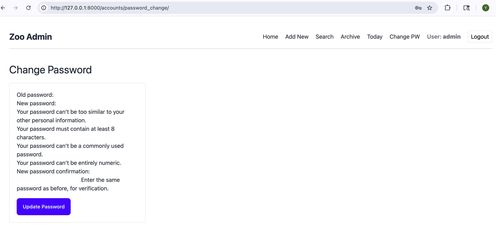
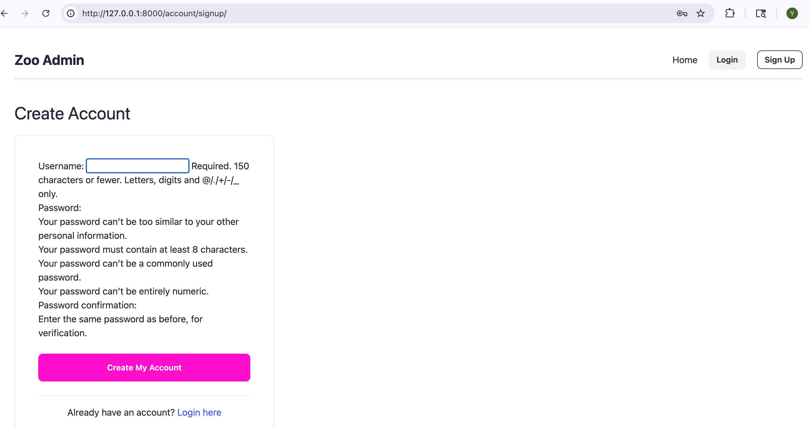

# 🦁 Animal Management System (Class 24)

A comprehensive Django web application to manage zoo animal data. This project features **automated data generation**, **CSV bulk importing**, **date-based archiving**, and a **secure user authentication system**.

---

## 📂 Project Structure

```text
zoo_project/ (Project Root)
│
├── manage.py
├── generate_animals_csv.py
├── animals_data.csv
│
├── zoo_site/
│   ├── settings.py
│   ├── urls.py
│   └── templates/
│       └── registration/
│           ├── login.html
│           ├── signup.html
│           ├── password_change_form.html
│           └── password_change_done.html
│
└── animals/
    ├── management/
    │   └── commands/
    │       └── import_animals_csv.py
    ├── templates/animals/
    │   ├── animal_list.html
    │   ├── animal_detail.html
    │   ├── animal_form.html
    │   ├── animal_confirm_delete.html
    │   ├── animal_search.html
    │   ├── animal_archive.html
    │   └── animal_archive_year.html
    ├── models.py
    ├── views.py
    └── urls.py
```

---

## ✅ Project Checklist

### 1. authentication
- [x] **Step 1 -** Enable Django's auth URLs
- [x] **Step 2 -** Configure settings
- [x] **Step 3 -** Add a signup view
- [x] **Step 4 -** Protect all animal views with LoginRequiredMixin
- [x] **Step 5 -** Create the templates
- [x] **Step 6 -** Update the navbar in `base.html`

### 2. change_password_fix
- [x] **Step 1 -** Create a project-level templates directory
- [x] **Step 2 -** Tell Django to look there first
- [x] **Step 3 -** Move the auth templates to the project-level directory

### 3. load_csv
- [x] **Step 1 -** Generate the CSV
- [x] **Step 2 -** Add the management command
- [x] **Step 3 -** Import the data

---

## 📸 Screenshots
| Page | Screenshot Preview |
| :--- | :--- |
| **Login** |  |
| **Animal List** |  |
| **Add Animal** |  |
| **Search** |  |
| **Archive** |  |
| **Archive-Year** |  |
| **Today** |  |
| **Change Password** |  |
| **Sign Up** |  |

---

## 🔗 Project Links
- **Repository:** https://github.com/lazy-h-null/my-exercise-archive/tree/main/25-apr23
